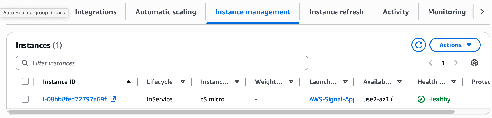
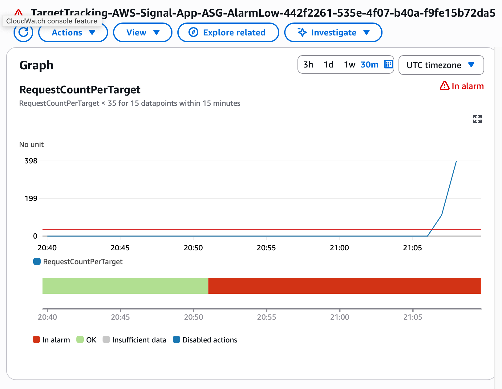
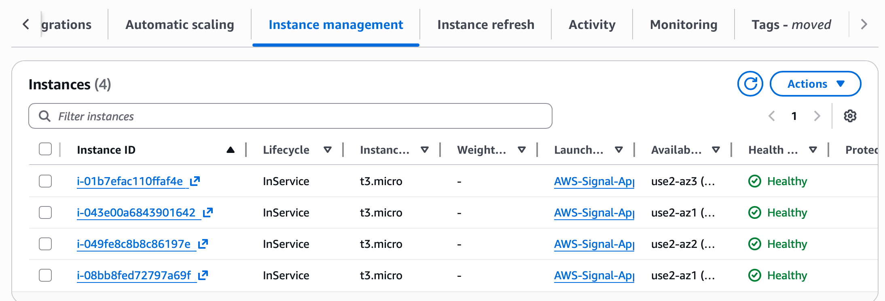
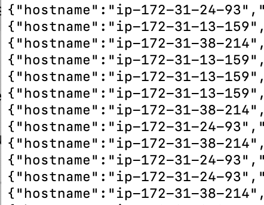
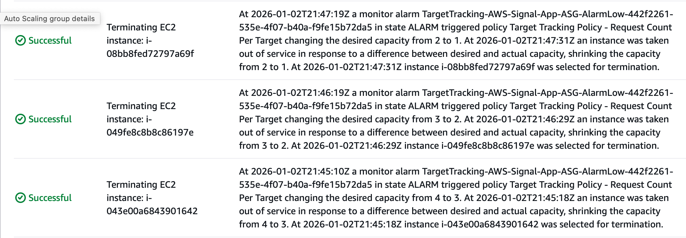
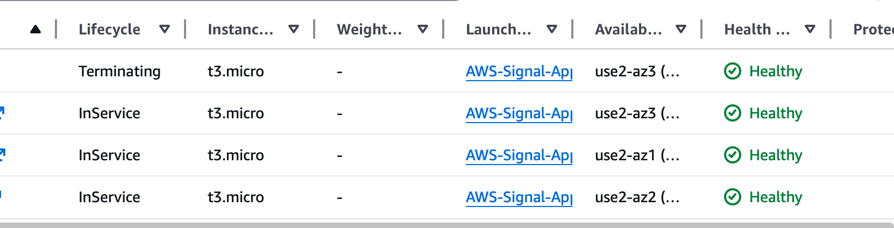

# Elastic Web Service on AWS (ALB + ASG Target Tracking)

A small Python HTTP service deployed behind an Application Load Balancer (ALB) and an Auto Scaling Group (ASG).  
The ASG uses **target tracking** on **ALB RequestCountPerTarget** to scale out under load and scale back in after traffic subsides.

## What this demonstrates
- ALB listener (HTTP :80) forwarding to a target group (HTTP :8080)
- Health checks via `/health`
- ASG instance bootstrapping using EC2 user data + systemd
- Target tracking auto scaling using **RequestCountPerTarget**
- Load balancing verification via hostname rotation
- Scale-in behavior with connection draining (deregistration delay)

## Architecture
Client -> ALB (:80) -> Target Group (:8080) -> ASG EC2 Instances (Gunicorn/Flask)

## Endpoints
- `GET /`  
  Returns instance hostname + timestamp (useful for verifying load balancing)
- `GET /health`  
  Health check endpoint (returns 200)
- `GET /work?ms=N`  
  Busy-loop for ~N milliseconds to generate load (clamped)

## How to run locally
```bash
python3 -m venv .venv
source .venv/bin/activate
pip install -r requirements.txt
python app.py
# open http://localhost:8080/
```

## Evidence

### Baseline


### Scale-out under load



### Load balancing verification


### Scale-in and convergence




